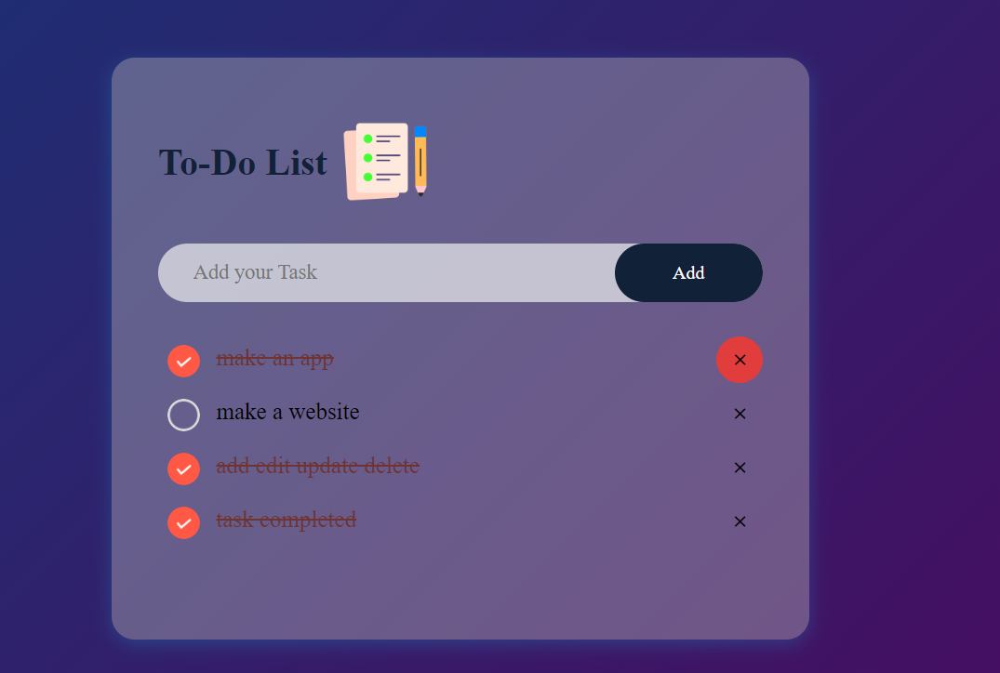

Name: Chaaya Agarwal

Company: CODTECH IT SOLUTIONS

ID: CT04WD2285

Domain: WEB DEVELOPMENT

Duration: JUNE to JULY 2024

Mentor: SRAVANI GOUNI

# Overview Of The Project

Project: A user friendly TO-DO LIST using HTML,CSS and JS!

Objective 
The objective of this project is to create a user-friendly and intuitive TO-DO list application. The application will allow users to easily add, delete, and mark tasks as completed. The goal is to provide a seamless user experience with a clean and responsive design.

Key Activities
Design a responsive layout that adapts to different screen sizes.
Build the application using HTML for structure, CSS for styling, and JavaScript for functionality.
Implement features for adding, deleting and marking tasks as completed.

Technologies Used
HTML: Structure the web page using semantic HTML elements.
CSS: Style the application to ensure a visually appealing and consistent design.
JavaScript: Implement functionality for adding, deleting, and marking tasks as completed.
Event Handling: Manage user interactions such as clicks and inputs.
Local Storage: Use browser local storage to persist tasks between sessions.

Key Insights

1. User Experience (UX):

Simple and intuitive interface enhances user engagement.
Clear visual feedback for user actions (e.g., task completion) improves usability.
Responsiveness

2. Development Best Practices:

Modular code structure makes the application easier to maintain and extend.
Using semantic HTML improves accessibility and SEO.
Efficient use of CSS and JavaScript optimizes performance and loading times.

3. Challenges and solutions

Managing state and data persistence was addressed using local storage, ensuring tasks remain even after page reloads.

4. Learning Outcomes:

Gained practical experience in front-end development.
Improved skills in responsive design and user-centric development.
Learned effective ways to handle and manipulate the DOM with JavaScript.